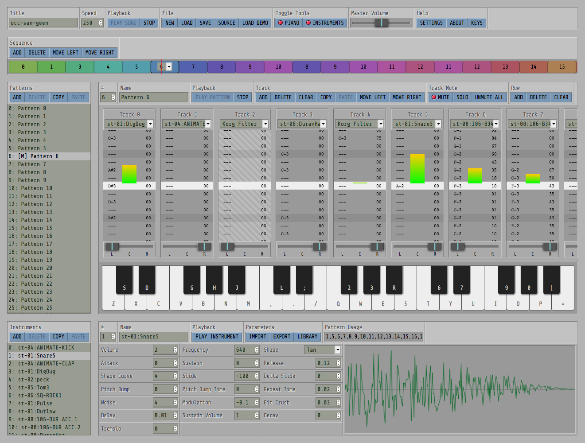

# ZzFXM Tracker

A [Svelte](https://svelte.dev/) application for composing music to use with the ZzFXM JavaScript music player.

## Installation

1. Clone this repo
2. Run `npm install`

## Build for devlopment

1. Run `npm run dev`

## Build for production

1. Run `npm run dist`
2. Deploy `/public` folder
